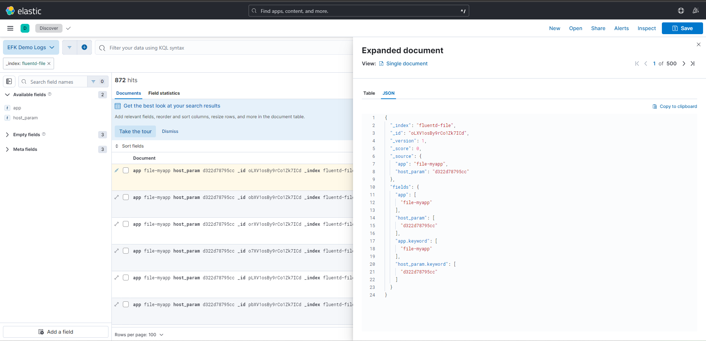

# Introduction to Fluentd

## Input plugins:

Where do we get logs from

use cases:

- Web server with application writting logs to a file
- Application that uses code logic to send logs to an http endpoint (e.g. Cloud service)
- Collecting logs from a Docker host with multiple containers running

## Output plugins:

Allows us to deliver logs to a file, database, S3, Kafka or Elasticsearch etc.

Output plugins match tags on logs from input plugins.

## Filter plugins:

Post processing pipeline used to transform logs before sending them to the output plugins.

## Demos:

### Use case 1 (Tail):

File based input source configuration: [file-fluent](./configurations/file-fluent.conf)

#### Collecting logs from files

Reading logs from a file we need an application that writes logs to a file. <br/>
Lets start one:

```
cd fluentd\introduction\

docker-compose up -d file-myapp

```

To collect the logs, lets start fluentd

```
docker-compose up -d fluentd
```

### Use case 2 (Http):

Http based input source configuration: [http-fluent](./configurations/http-fluent.conf)

#### Collecting logs over HTTP (incoming)

```
cd fluentd\introduction\

docker-compose up -d http-myapp

```

### Use case 3 (Container):

Container based input source configuration: [containers-fluent](./configurations/containers-fluent.conf)

#### Collecting logs from Docker

```
# Mount docker host logs into fluentd container

# Restart fluentd service
docker-compose restart fluentd

```

While Fluentd is running, start up another container

```
docker run -it redis
```

Notice redis logs are now collected in the log output buffer.

### Output logs externally

In a real production use case, its preferable to send logs into a central location externally.

#### Sending logs to Elasticsearch

Setup Elasticsearch plugin in a fluentd container: [dockerfile](./dockerfile)

```
docker-compose build fluentd
```

Fluentd configuration for sending all use case logs to Elasticsearch:

[elasticsearch-fluent](./configurations/elastic-fluent.conf)

Note: Since we are sending logs to elasticsearch we should stop sending logs to files by commenting out
match blocks in our `file`, `http` and `container` fluentd configuration files.

Restart fluentd

```
docker-compose restart fluentd
```

Start up elasticsearch and kibana services.

```
docker-compose up -d elasticsearch kibana
```

#### Verify logs with Kibana

Access Kibana at: localhost:5601/app/home#/

Create a data view with this index pattern `fluentd-*`. Then filter data view for logs from `fluentd-file`.



## Troubleshooting

1. Error with Elasticsearch container starting up:

```
Error:
max virtual memory areas vm.max_map_count [65530]  is too low, increase to at least [262144]

Fix:
1) open powershell terminal and run:
2) wsl -d docker-desktop
3) sysctl -w vm.max_map_count=262144
```

2. Incompatible Container versions

Visit dockerhub and do some research on the updated versions and their compatibility, then update your
`docker-compose.yaml` file.

3. Issues with Collecting logs over HTTP

If the `http-myapp` refuses to start up, you can modify the docker-compose.yaml

```
# create a container that sets up curl and stays running

http-myapp:
  container_name: http-myapp
  image: alpine:latest
  command: sh -c "apk add --no-cache curl && tail -f /dev/null"
  networks:
    - logging-network
```

To access the shell of the running container and set up your script, you can use the following commands:

i. Access container:

```
docker exec -it http-myapp /bin/sh
```

ii. create script:

```
cd /app

rm ./http-app.sh

vi ./http-app.sh, press i to insert

copy paste http-app.sh content

press esc & :wq to save and exit

chmod +x /app/http-app.sh

execute script: ./http-app.sh
```

iii. You should see the following output:

```
/app # ./http-app.sh
Sending logs to FluentD
Sending logs to FluentD
Sending logs to FluentD
```
